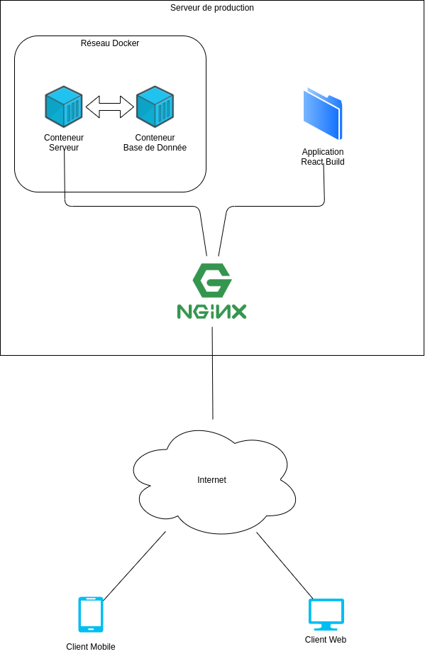

# Architecture de l'application

## Choix de technologie
L'application est séparée en 3 parties. Le Front-End Web, le Front-End Mobile et le Back-End. Dans chacunes des parties nous avons du faire des choix de technologies.

### Back-End
Au niveau de l'API, le principal choix a été de développer l'API sous NodeJS avec la bibliothèque Express, et Sequelize comme ORM. Nous avons fait ce choix puisque NodeJS était la technologie que nous maitrisions le plus et nous pensions pouvoir avoir une API la plus simple possible grâce à cela.  
Le choix supplémentaire a été d'utiliser Docker et Docker-Compose pour le développement et la production, pour avoir un environnement de développement simple avec une base de donnée liée uniquement à l'application. Et grâce à Docker, on peut build notre conteneur en local, ensuite le mettre sur le dépot d'image Gitlab, avant de le récupérer sur notre serveur et de le déployer.  

Parmis les bibliothèques, le choix de Express a été rapide puisqu'il est qu'une légère surcouche au module HTTP de NodeJS, tout en nous fournissant une API bien plus simple à écrire. Sequelize lui a été choisit puisque c'est une bibliothèque à la fois très complête mais simple d'utilisateur, avec la possibilité d'utiliser différentes bases de données à notre convenance, ici MySQL.  

En plus de ça, nous utilisons Typescript pour la définition des routes, pour avoir une syntaxe d'écriture de celles ci rigoureuse et nous permetant de typer fortement les différents attributs, pour empecher des erreurs qui viendraient de routes non ou mal définies.

La sécuritée elle a été gérée via des JSON Web Token, la technologie la plus simple pour avoir un système unique entre le mobile et le web, surtout pour des applications distribuées sur des URL différentes.

Et enfin le choix de Nginx comme Reverse Proxy est très pragmatique, c'est celui qui était déjà sur notre serveur de déploiment. Il est plus léger et moins complexes que Appache, si on a juste besoin de servir des fichiers statiques et d'avoir un reverse proxy.

### Front-End Web

Concernant l'application web, notre choix s'est porté sur React pour diverses raisons :
* La première et la plus évidente est nos connaissances sur ce framework. Nous nous sentions capable de répondre au besoin évoqué à l'aide de React grâce aux nombreux cours, mais aussi aux connaissances que nous avions sur les framework en JavaScript.
* La seconde est que certain professeurs de l'équipe pédagogique ont des connaissances sur le sujet, nous pouvions donc les soliciter en cas de besoin.
* La dernière raison est que les personnes chargées du développement web appréciait tout simplement cette technologie.

Nous avions choisi de partir sur du JavaScript et non du TypeScript par expérience, car le TypeScript réagit assez mal avec tout ce qui est élément mutable du DOM ou bien tout simplement localStorage, et nous ne voulions pas définir des types `any` dans toute l'application.

Concernant le framework CSS, nous avions décidé de partir sur Material-Ui, car nous voulions essayer d'apprendre plus en profondeur sur ce framework CSS, mais aussi pour gagner beaucoup de temps dans tout ce qui concerne style d'interfaces.

Enfin, concernant le coeur de l'application, nous avons penché pour Leaflet en tant que système de CRS, pour la carte donc. Il y avait diverses possiblités, cependant, en connaissance de quelques projets, comme la [carte communautaire interactive de satisfactory](https://satisfactory-calculator.com/en/interactive-map), nous savions que répondre aux besoins énoncés tel que créer un moteur de jeu basé sur une carte virtuelle serait possible avec Leaflet.

### Front-End Mobile
