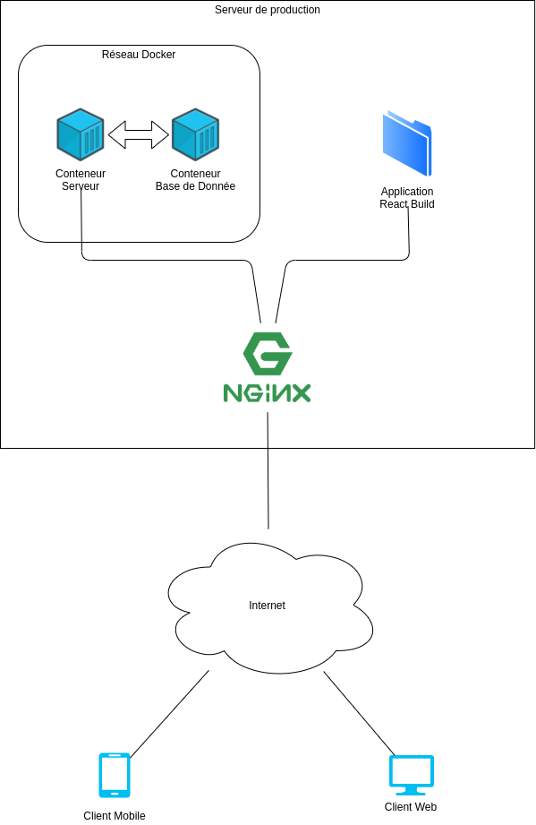

# Documentation
Vous trouverez dans ce dossier tous les documents que nous avons utilisés pendant notre projet, dans le dossier `drive`.  
Vous trouverez aussi les liens vers les différents fichiers de documentations dans les différentes parties du projet, pour pouvoir y accèder facilement.

## Architecture
Schéma de notre infrastructure: 

- [FrontEnd Web](../web/README.md#architecture)
- [FrontEnd Mobile](../mobile/README.md#architecture)
- [BackEnd](../serveur/README.md#architecture)

## Développeur (organisation du code)
- [FrontEnd Web](../web/README.md#développeur-organisation-du-code)
- [FrontEnd Mobile](../mobile/README.md#développeur-organisation-du-code)
- [BackEnd](../serveur/README.md#développeur-organisation-du-code)

## Déploiement
- [Comment utiliser Nginx](./Nginx.md)
- [FrontEnd Web](../web/README.md#déploiement)
- [FrontEnd Mobile](../mobile/README.md#déploiement)
- [BackEnd](../serveur/README.md#déploiement)